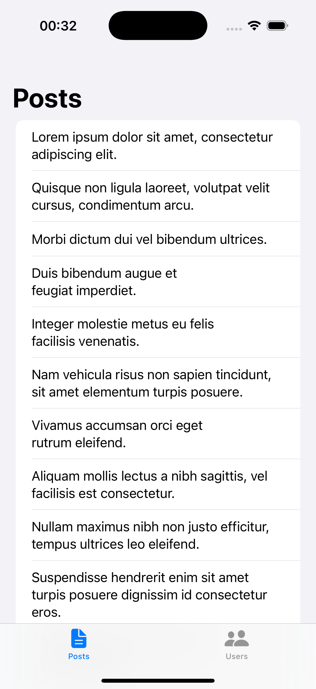
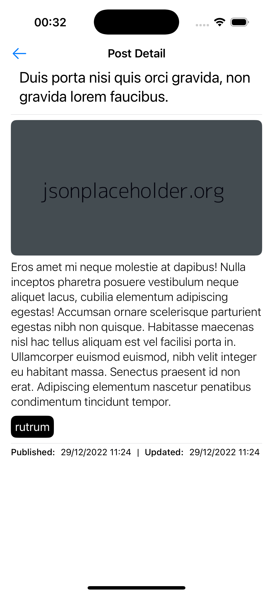
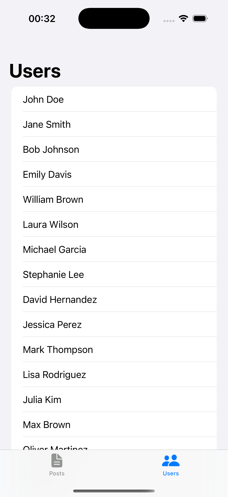
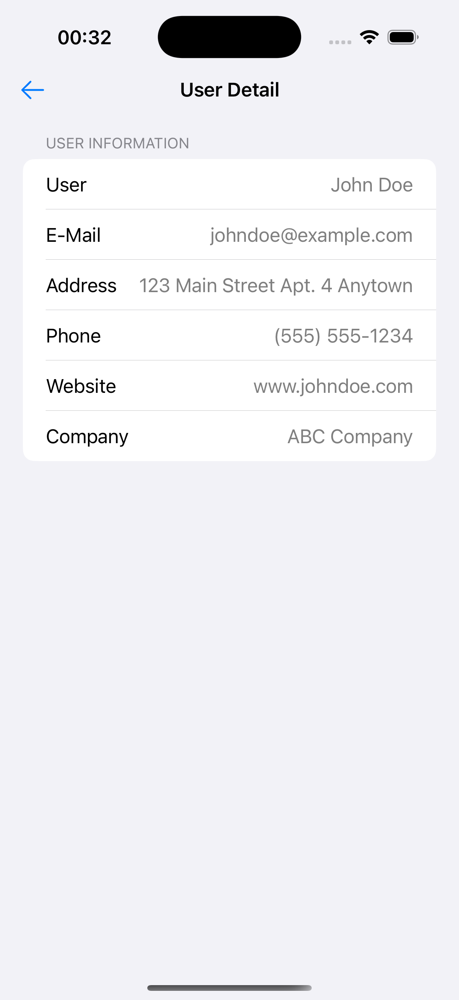

# UserPostBook

<details close>
  <summary>Uygulamaya ait ekran görüntülerini görmek için tıklayın.</summary>
     
</details>

## Teknoloji

SwiftUI

## Mimari

MVVM

## Özellikler

- Gönderilerin listelenmesi ve detayının gösterilmesi.
- Kullanıcıların listelenmesi ve detayının gösterilmesi.

## Kurulum

Bu depoyu yerel makinenizde klonlayın.

```
git clone https://github.com/ibrahimaykutbas/UserPostBook.git
```

### Hazırlık

Projeyi klonladıktan sonra ilgili dizine gidin.

```
cd UserBook
open UserBook.xcodeproj
```

Bu talimatlar, geliştirme ve test amacıyla yerel makinenizde projenin bir kopyasını hazır hale getirecektir.
